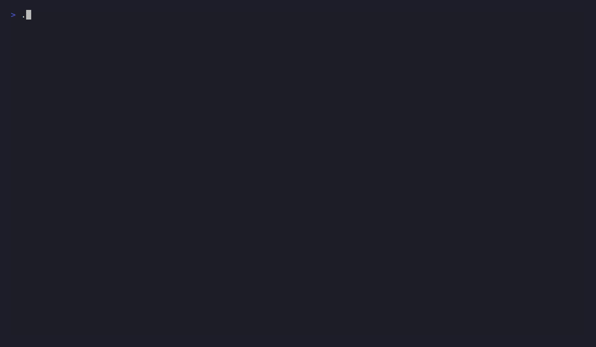

# catnet-tui

**Official Webpage & Documentation:** [https://catnet-io.github.io/tui/](https://catnet-io.github.io/tui/)

catnet-tui is the terminal user interface for the CatNet ecosystem.

It focuses on keyboard-first workflows, live execution visibility, result navigation, filtering, and export operations, powered by catnet-core.

## Example

## Goals
- Deliver a rich terminal workflow for operators.
- Make scan runs observable and easy to navigate.
- Keep interface logic separate from scan domain logic.
- Reuse core contracts without reimplementing them.

## Planned views
- Welcome
- Target input
- Running jobs
- Hosts table
- Network topology map (ASCII/Lipgloss tree via engine/pkg/topology)
- Host details
- Export dialog
- History

## Status
Bootstrap phase. UX flows and component boundaries are under active design.

## Development & Security (DevSecOps)
- **Branching Policy**: `develop` is the main collaboration branch; `main` only accepts signed, automated PRs from `develop` created by `github-actions[bot]`.
- **CI/CD**: Workflows validate builds, dependencies, and SAST on both `main` and `develop` branches.

## Part of the CatNet ecosystem

| | Repository | Role |
|---|---|---|
| ⚙️ | [catnet-io/engine](https://github.com/catnet-io/engine) | Shared Go scanning engine |
| 💻 | [catnet-io/catnet](https://github.com/catnet-io/catnet) | CLI |
| 🖥️ | [catnet-io/app](https://github.com/catnet-io/app) | Desktop app |
| 📟 | [catnet-io/tui](https://github.com/catnet-io/tui) | Terminal UI |

## License

This project is licensed under the MIT License - see the [LICENSE](LICENSE) file for details.